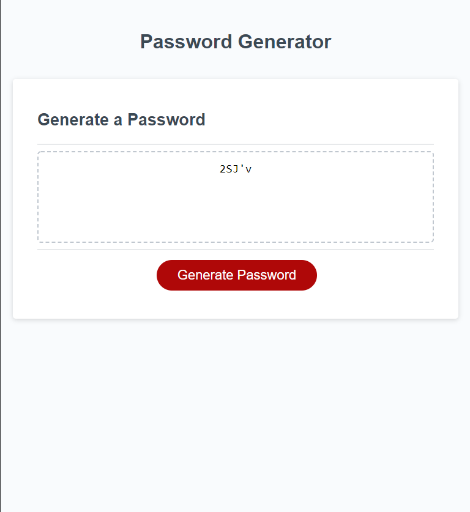

In Challenge 3 I was able to apply what I've learned about loops, arrays, and functions in Javascript. 

In the js file i've used a for loop and the math built in function to generate a random number, and a switch statement to select the characters for the passwords. 

Screenshot of the page: 

Link to deployed application: 